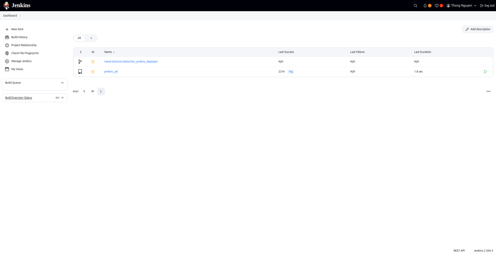
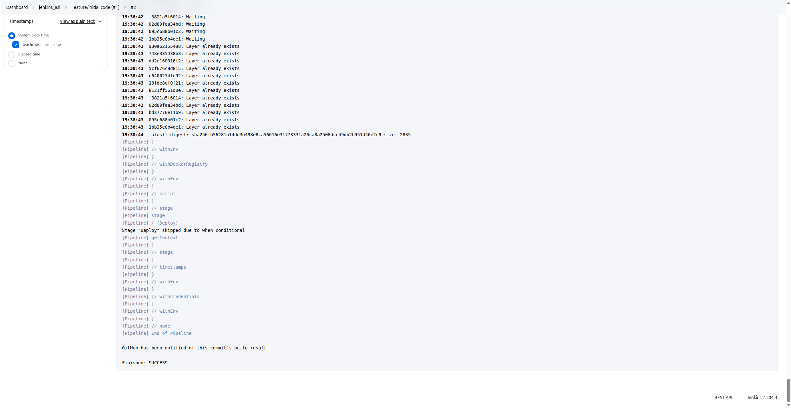
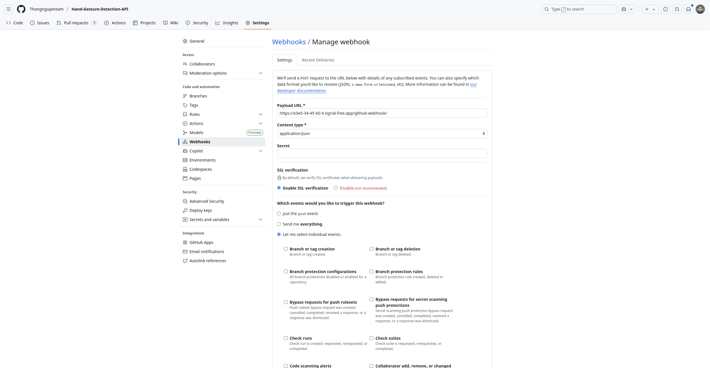
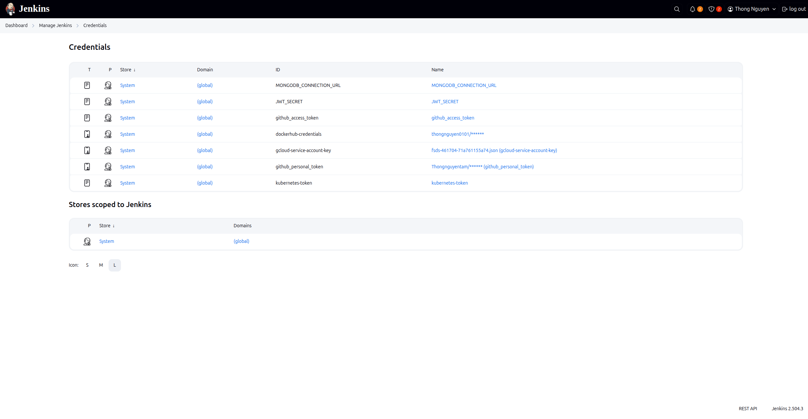
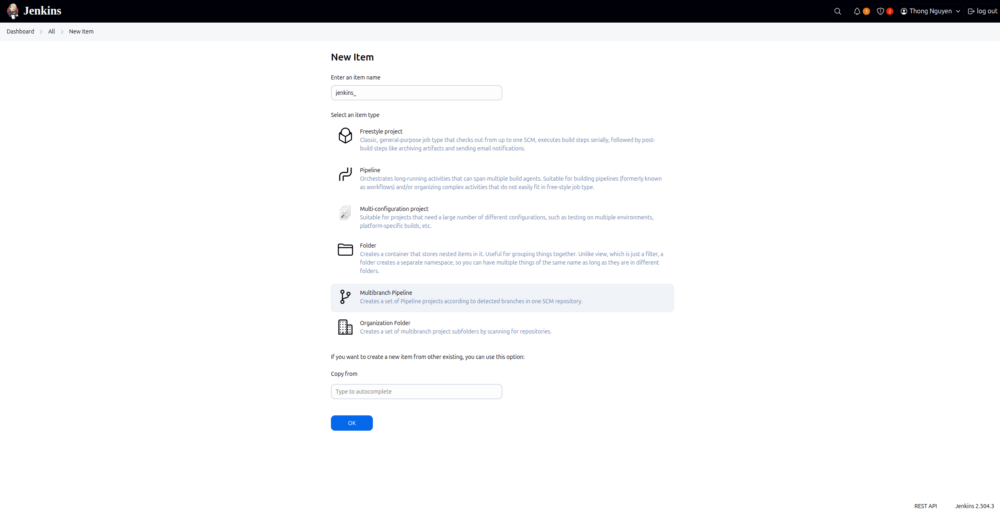

# 3. Jenkins Setup Guide

<div align="center">
  
  <p><em>Jenkins Dashboard</em></p>
</div>

This guide covers the one-time setup and configuration for the Jenkins controller instance. This includes granting it the necessary permissions, accessing the VM, exposing it for webhooks, and configuring credentials in the UI.


<div align="center">
  
  <p><em>Jenkins Success Dialog</em></p>
</div>

---

## 1. Prerequisite: Grant Jenkins CI/CD Permissions

Before Jenkins can deploy to your GKE cluster, you must grant its underlying service account two sets of permissions: one in Google Cloud (IAM) and one inside Kubernetes (RBAC).

### A. Grant Google Cloud IAM Role

This step allows the Jenkins service account to authenticate with GKE and manage cluster resources at the GCP level.

1.  **Authenticate as a Human User:**
    You must first log in with a Google account that has permission to manage IAM roles (e.g., Project Owner).
    ```shell
    gcloud auth login
    gcloud config set project fsds-461704

    # You can later log in to your service accoubnt using the json key after creating the service account for jenkins
    
    gcloud auth activate-service-account --key-file=fsds-461704-71a761155a74.json
    ```

2.  **Bind the IAM Policy:**
    This command grants the `Kubernetes Engine Admin` role to your Jenkins service account, allowing it manage GKE resources.
    ```shell
    gcloud projects add-iam-policy-binding fsds-461704 \
      --member="serviceAccount:jenkins-deployer@fsds-461704.iam.gserviceaccount.com" \
      --role="roles/container.admin"
    ```
- **What it does:** It attaches a role to a member 
(or principal) within your Google Cloud project's IAM 
(Identity and Access Management) policy.
- `--member="serviceAccount:..."`: The member you are 
granting permissions to. In this case, it's the 
jenkins-deployer service account that your Jenkins 
pipeline uses.
- `--role="roles/container.admin"`: The set of 
permissions you are granting. The Kubernetes Engine 
Admin role is a powerful, predefined role that gives 
the service account full control over GKE clusters. 
This includes permissions to get cluster credentials, 
describe deployments, and manage cluster resources at 
the Google Cloud level.

### B. Grant Kubernetes RBAC Role

This step allows the Jenkins process, once authenticated, to create and manage resources *inside* the cluster.

1.  **Get Cluster Credentials:**
    First, ensure `kubectl` is pointing to your GKE cluster.
    ```shell
    gcloud container clusters get-credentials asl-cluster --region us-central1
    ```

```shell
kubectl create serviceaccount jenkins -n model-serving
```

2.  **Create the ClusterRoleBinding:**
    This command gives the `jenkins` Kubernetes ServiceAccount (used by your pipeline) admin-level privileges, allowing it to run `helm upgrade`.
    ```shell
    kubectl create clusterrolebinding jenkins-admin-binding \
      --clusterrole=admin \
      --serviceaccount=model-serving:jenkins
    ``` 

- **The Context:** Just because your jenkins-deployer 
service account can authenticate with the cluster 
doesn't mean it can do anything inside it. Kubernetes 
has its own authorization system called RBAC 
(Role-Based Access Control). This command configures 
RBAC permissions.

- `kubectl create clusterrolebinding ...`: This 
command creates a `ClusterRoleBinding`.
  - What it does: It binds a ClusterRole (a set of 
  permissions that apply cluster-wide) to a specific 
  user or service account.
  - `--clusterrole=admin`: The role you are granting. 
  admin is a default, built-in ClusterRole that 
  provides full, super-user permissions on all 
  resources within a specific namespace. If you bind 
  it at the cluster level (as we are here), it grants 
  admin rights across the entire cluster.
  - `--serviceaccount=model-serving:jenkins`: The 
  subject you are granting the role to. This refers 
  to a Kubernetes ServiceAccount named **jenkins** 
  that exists within the **model-serving namespace**. 
  It's important to note this is a Kubernetes-level 
  account, distinct from the Google Cloud service 
  account.

---

==> Why we do this: This command gives the Jenkins 
process, once it's authenticated to the cluster, the 
authority to actually perform actions like helm 
upgrade, which involves creating and modifying 
Deployments, Services, Secrets, and other Kubernetes 
resources. Without this, Jenkins would get 
"Permission Denied" errors from the Kubernetes API 
server.

### C. Generate the service account token for Jenkins K8s
You need this to configure Jenkins Kubernetes Cloud:

```bash
kubectl create token jenkins -n model-serving
```

- Copy this token 
- **What it does:** This command generates a 
temporary authentication token for the Kubernetes 
ServiceAccount named jenkins in the model-serving 
namespace.
- **Why we do this:** This token is a credential. You 
would use this token, along with the cluster's CA 
certificate and server URL, to configure the 
"Kubernetes Cloud" plugin in the Jenkins UI. It 
allows the main Jenkins controller to authenticate to 
your GKE cluster to dynamically provision Jenkins 
agents if you were using that feature.

### D. Get CA cert & cluster URL

```bash
kubectl config view --minify --raw
```

- **What it does:** This command prints a condensed 
version of your kubeconfig file. The output contains 
the essential information needed to connect to a 
cluster from an external tool, including:
  - **server**: The URL of the Kubernetes API server 
  endpoint.
  - **certificate-authority-data**: The public CA 
  certificate used to verify the identity of the API 
  server.
- **Why we do this:** You would copy these values and 
paste them into the Jenkins "Kubernetes Cloud" 
configuration page, along with the token from the 
previous command.

## 2. Accessing the Jenkins VM

After provisioning, you can connect to the Jenkins instance via SSH to check its status or debug.

```shell
gcloud compute ssh jenkins-asl --zone us-central1-a
```

Once connected, you can check the status of the Jenkins service:
```shell
# Check if the Jenkins service is active and running
sudo systemctl status jenkins

# Verify that Jenkins is listening on its default port
sudo ss -tuln | grep 8080
```

---

## 3. Exposing Jenkins for GitHub Webhooks

<div align="center">
  
  <p><em>Jenkins Github Webhook</em></p>
</div>

For Jenkins to receive push and pull request events from GitHub, its web endpoint must be accessible from the public internet. During development, `ngrok` is an excellent tool for creating a temporary secure tunnel.

1.  **Start a `tmux` Session:**
    Using `tmux` is recommended as it allows the ngrok tunnel to run persistently in the background on the server, even if you disconnect your SSH session.
    ```shell
    tmux
    ```

2.  **Start the ngrok Tunnel:**
    This will forward all traffic from a public `https` URL to your Jenkins instance on port 8080.
    ```shell
    ngrok http 8080
    ```
    Copy the `https://<...>.ngrok-free.app` URL provided by ngrok. You will use this as the "Payload URL" for your GitHub webhook.

3.  **Detach from the `tmux` Session:**
    Press `Ctrl + B`, then `D`. The session will continue running.

4.  **Reconnecting Later:**
    ```shell
    # Re-attach to the last session
    tmux attach

    tmux attach-session -t 0 # attach session 0
    ```

---

## 4. Configuring Jenkins Credentials in the UI

<div align="center">
  
  <p><em>Jenkins Credentials Setup</em></p>
</div>

Your `Jenkinsfile` references several credentials that must be created in the Jenkins UI (`Manage Jenkins` > `Manage Credentials`). This approach is secure because Jenkins encrypts these values and prevents them from being exposed in logs.

-   **Docker Hub Credentials (`dockerhub-credentials`):**
    -   **Kind:** Username with password
    -   **Username:** Your Docker Hub username
    -   **Password:** Your Docker Hub access token
    -   **ID:** `dockerhub-credentials`

-   **Secret Text Credentials (for environment variables):**
    -   **Kind:** Secret text
    -   **IDs:** `MONGODB_CONNECTION_URL`, `JWT_SECRET`, `github_access_token`

-   **Google Service Account Key (`gcloud-service-account-key`):**
    -   **Kind:** Secret file
    -   **File:** Upload the JSON key file you downloaded from your Google Cloud service account.
    -   **ID:** `gcloud-service-account-key`

---

## 5. Understanding the Multibranch Pipeline Flow

<div align="center">
  
  <p><em>Jenkins Multibranch Pipeline Flow</em></p>
</div>


The CI/CD pipeline is designed to handle different Git events in specific ways:

-   **Push Events:** A direct push to any branch.
-   **Pull Request Events:** A new PR is opened, updated with new commits, or merged/closed.

The pipeline stages react to these events as follows:

1.  **Developer creates a feature branch and opens a Pull Request.**
    -   **Result:** Jenkins runs the `Test` and `Build` stages to validate the changes. The `Deploy` stage is skipped.

2.  **The team reviews and approves the Pull Request, and it is merged into `main`.**
    -   **Result:** This triggers a new build on the `main` branch. Jenkins runs the `Test`, `Build`, AND `Deploy` stages, releasing the new feature into production. 