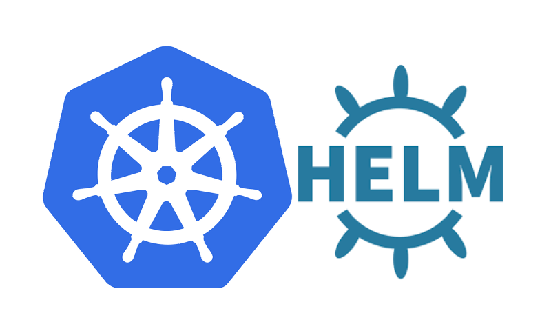
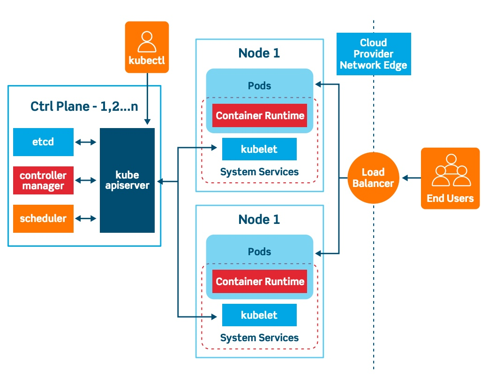
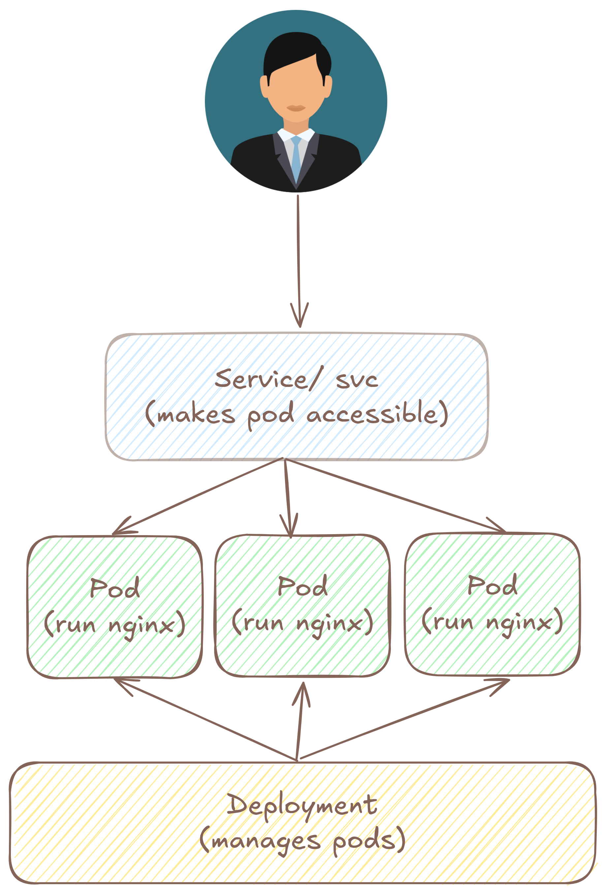

# 4. Kubernetes Deployment Guide (Helm)

This guide provides a detailed explanation of how the application is packaged and deployed onto a Kubernetes cluster using Helm.

<div align="center">
  
  <p><em>Kubernetes and Helm</em></p>
</div>
---

## 1. What is Kubernetes?

Before diving into Helm, it's important to understand Kubernetes, the platform our application runs on. [Kubernetes](https://kubernetes.io/) (often abbreviated as K8s) is an open-source container orchestration system for automating software deployment, scaling, and management. It allows us to run our application reliably and scalably in a production environment.

At its core, Kubernetes manages a cluster of compute instances (nodes) and schedules containers to run on them based on available resources. It provides several key abstractions that we use to define our application:

-   **Pods**: The smallest deployable units in Kubernetes. A Pod represents a single instance of a running process in your cluster and can contain one or more containers.
-   **Deployments**: A higher-level object that manages Pods. A Deployment ensures that a specified number of Pod replicas are running at all times and handles updates and rollbacks seamlessly.
-   **Services**: An abstraction that defines a logical set of Pods and a policy by which to access them. Services provide a stable network endpoint (like an IP address and port) for a group of Pods, whose own IPs can change.
-   **Ingress**: An API object that manages external access to the services in a cluster, typically HTTP. Ingress can provide load balancing, SSL termination, and name-based virtual hosting.

### Kubernetes Architecture: Control Plane and Worker Nodes

<div align="center">
  
  <p><em>Kubernetes architecture</em></p>
</div>
Understanding Kubernetes architecture helps explain how our application runs reliably at scale. A Kubernetes cluster consists of two main components:

**Control Plane**: The brain of the cluster that makes global decisions about the cluster (like scheduling) and detects and responds to cluster events. In managed services like GKE, Google handles the control plane for us.

**Worker Nodes**: The machines that run your application workloads. Each worker node runs several key components:

-   **kubelet**: The primary node agent that communicates with the control plane. It ensures that containers described in Pod specifications are running and healthy. The kubelet watches for Pod assignments from the control plane and manages the container lifecycle, including pulling images, starting/stopping containers, and reporting Pod status back to the control plane.

-   **kube-proxy**: A network proxy that runs on each node and maintains network rules. It handles the networking aspect of Services by implementing load balancing and routing rules. When you create a Service, kube-proxy ensures that traffic sent to the Service's IP address gets properly forwarded to the backend Pods, even as Pods are created, destroyed, or moved between nodes.

-   **Container Runtime**: The software responsible for running containers (like Docker or containerd). This is what actually executes our application containers.

This distributed architecture ensures that even if individual nodes fail, the control plane can reschedule workloads to healthy nodes, and kube-proxy ensures network connectivity is maintained.

Kubernetes provides the robust foundation, and Helm helps us manage the complexity of defining and deploying these resources.

---

## 2. What is Helm?

[Helm](https://helm.sh/) is the package manager for Kubernetes. It allows us to bundle all the necessary Kubernetes resource definitions (like Deployments, Services, etc.) into a single, versioned package called a **chart**.

This chart-based approach provides several key benefits:
-   **Reproducibility:** You can deploy the exact same application architecture to any Kubernetes cluster.
-   **Configuration:** You can easily customize a deployment for different environments (e.g., development vs. production) by overriding default values.
-   **Simplicity:** It simplifies complex deployments into a single `helm install` or `helm upgrade` command.

Our chart is located in the `helm-charts/asl/` directory and has the following structure:

```
helm-charts/asl/
├── Chart.yaml          # Metadata about the chart (name, version, etc.).
├── values.yaml         # Default configuration values.
└── templates/          # Directory containing the Kubernetes manifest templates.
    ├── deployment.yaml # Defines the application Pods.
    ├── service.yaml    # Defines how to access the Pods.
    ├── ingress.yaml    # Defines how external traffic reaches the Service.
    └── secrets.yaml    # Defines how to manage sensitive data.
```

---

## 3. Kubernetes Resources Explained

Our Helm chart defines four key Kubernetes resources that work together to run the application.

<div align="center">
  
  <p><em>Helm Chart Component</em></p>
</div>

### A. Deployment (`deployment.yaml`)

-   **Purpose:** The Deployment is the blueprint for our application pods. Its main job is to ensure that a specified number of identical replicas are always running.
-   **Key Actions:**
    -   It pulls the correct Docker image (`thongnguyen0101/hand-gesture-detection`) from the registry specified in `values.yaml`.
    -   It creates the Pods based on the template, which includes defining the container and the `containerPort` (`30000`) that the application listens on.
    -   It manages the secure injection of environment variables from our Kubernetes Secret.
    -   If a pod crashes, the Deployment Controller automatically creates a replacement, ensuring high availability.

### B. Service (`service.yaml`)

-   **Purpose:** The Service provides a stable, internal network endpoint to access the application pods.
-   **Key Actions:**
    -   It groups a set of pods using a `selector` that matches the labels on the pods created by the Deployment.
    -   It is a `ClusterIP` service, meaning it's only accessible from *within* the Kubernetes cluster. This is a security best practice, as we don't want to expose our application directly to the internet.
    -   It forwards traffic it receives on its port (`30000`) to the `targetPort` (`30000`) on the pods.

### C. Ingress (`ingress.yaml`)

-   **Purpose:** The Ingress is the gateway for external traffic. It manages all incoming requests from the public internet and routes them to the correct internal service.
-   **Key Actions:**
    -   It listens for traffic (e.g., at `http://<your-domain>/api`).
    -   It uses rules to forward that traffic to the `hand-gesture` Service on its designated port.
    -   The annotation `kubernetes.io/ingress.class: "nginx"` tells GKE to use the NGINX Ingress controller to manage this resource.


Reversed Proxy with Nginx Ingress:
- Rewriting URL
```yaml
yaml
annotations:
  nginx.ingress.kubernetes.io/rewrite-target: /$2
```
This tells NGINX Ingress to rewrite the request path.

- Given this path rule:
```yaml
- path: /api(/|$)(.*)
```

🚀 It matches requests like:
- /api
- /api/
- /api/v1/hello

🔧 And rewrites them to:
/$2 → which becomes everything after /api

So:
- Request to `/api/hello` → FastAPI sees it as `/hello`
- Request to `/api/v1/hello` → FastAPI sees `/v1/hello`

### D. Secret (`secrets.yaml`)

-   **Purpose:** The Secret resource securely stores and manages sensitive configuration data, such as API keys and database URLs.
-   **Key Actions:**
    -   The secret is created by Helm using values passed securely from the Jenkins pipeline.
    -   All data within a Kubernetes secret is stored in a Base64-encoded format.
    -   The `deployment.yaml` references this secret using `envFrom`, which tells Kubernetes to mount each key-value pair from the secret as an environment variable in the application container. Kubernetes handles the Base64 decoding automatically.

---

## 4. The Traffic and Data Flow

Understanding the flow of a request and data is key to understanding the architecture.

**A. Networking Traffic Flow:**
A user request follows this path:
`External Internet` → `NGINX Ingress` → `ClusterIP Service` → `Application Pod (Container)`

1.  The **Ingress** receives the request and, based on its rules, forwards it to the **Service**.
2.  The **Service** acts as an internal load balancer, forwarding the request to a healthy **Pod**.
3.  The request arrives at the **Pod** on its `containerPort`, where the FastAPI application is listening.

**B. Secret Data Flow:**
Secrets are handled securely and never exposed in code or images:
1.  **Jenkins** reads encrypted credentials.
2.  It passes the plain-text secrets to **Helm** via a temporary file during the `helm upgrade` command.
3.  **Helm** creates a **Kubernetes Secret**, Base64-encoding the values.
4.  The **Deployment** mounts this secret into the **Pod** as environment variables.
5.  Your **FastAPI application** reads the configuration from these environment variables. 


Adding the ingress-nginx Helm repository.
```shell
helm repo add ingress-nginx https://kubernetes.github.io/ingress-nginx
```

Update your Helm repositories.
```shell
helm repo update
```

Install the NGINX Ingress Controller using Helm:
```shell
helm install ingress-nginx ingress-nginx/ingress-nginx --namespace ingress-nginx --create-namespace
```

Let's check the status of the ingress-nginx-controller service to see if it has received an EXTERNAL-IP yet.
```shell
kubectl get service --namespace ingress-nginx ingress-nginx-controller --output wide
```

You can see something like this:
```console
NAME                       TYPE           CLUSTER-IP    EXTERNAL-IP    PORT(S)                      AGE     SELECTOR
ingress-nginx-controller   LoadBalancer   10.3.251.92   34.63.222.25   80:31840/TCP,443:30840/TCP   7h36m   app.kubernetes.io/component=controller,app.kubernetes.io/instance=ingress-nginx,app.kubernetes.io/name=ingress-nginx
```

In `helm-charts/asl/templates/ingress.yaml`:

1. `path: /api(/|$)(.*)`: This changes the path from a simple prefix to a regular expression (regex).
- `/api`: This matches the literal path `/api`.
- `(/|$)`: This is the first capturing group. It matches either a forward slash (`/`) immediately following `/api` (for paths like `/api/docs`) OR the end of the line (`$`) (for the path `/api` itself). This makes the trailing slash optional.
- `(.*)`: This is the second capturing group. It's the most important part for the rewrite. It captures everything that comes after `/api/` or `/api`. For example, in `/api/docs`, it captures docs. In `/api/asl/predict`, it captures `asl/predict`.

2. `pathType: ImplementationSpecific`: When you use a regular expression in the path, you must change the pathType from `Prefix` to `ImplementationSpecific`. This tells the Ingress controller to interpret the path as a regex instead of a simple string prefix.

3. `nginx.ingress.kubernetes.io/rewrite-target: /$2`: This is the NGINX-specific annotation that performs the magic.

- It instructs the Ingress controller to rewrite the request path before sending it to your service.
- The value `/$2` uses the captured groups from our regex. The `$2` is a placeholder for the second capturing group, which is `(.*)`.
- So, when a request for `http://<ip>/api/asl/predict` hits the Ingress, the controller rewrites the path to `/asl/predict` and forwards that to your FastAPI application.