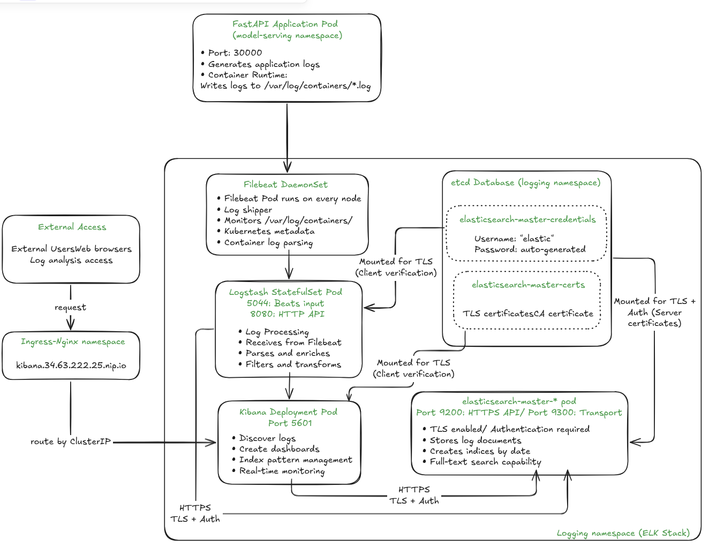
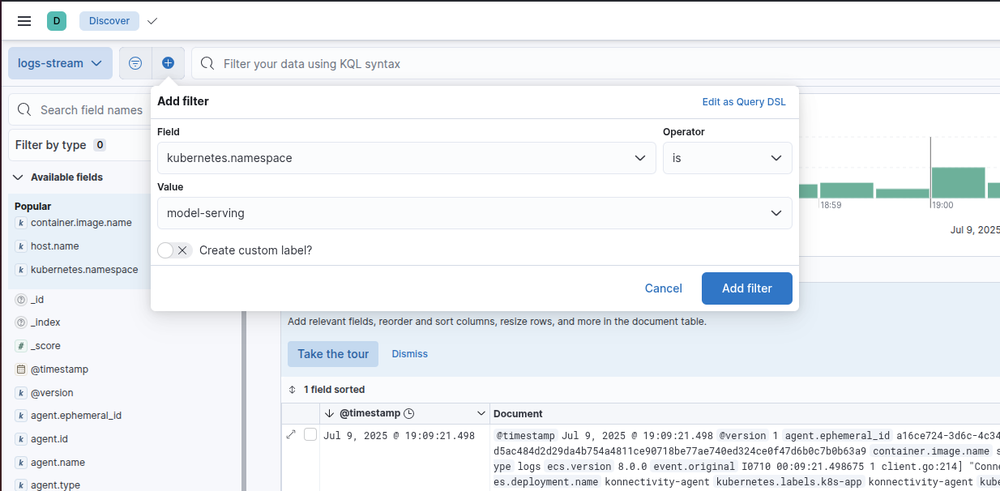
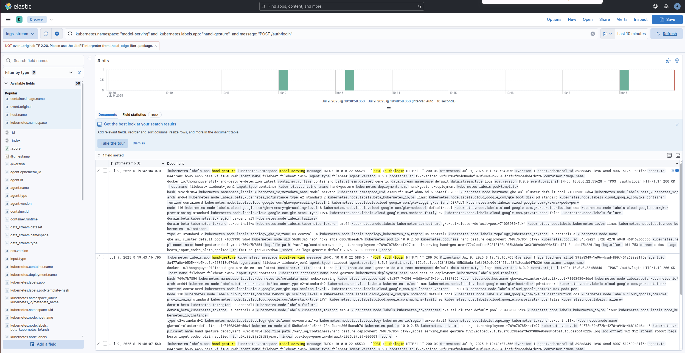

# 5. Logging with ELK Stack

This guide explains how to set up a comprehensive logging stack for your Kubernetes cluster using the **ELK Stack** (Elasticsearch, Logstash, Kibana). This setup provides centralized log collection, processing, and visualization for all your applications and system components.

We will deploy the logging stack in a `logging` namespace and expose Kibana through Nginx Ingress for easy web access.

---

## 1. Architecture Overview

<div align="center">
  
  <p><em>ELK Architecture Overview</em></p>
</div>

Our logging architecture consists of:
- **Elasticsearch** - Distributed search and analytics engine for storing logs
- **Filebeat** - Lightweight log shipper deployed as DaemonSet on all nodes
- **Logstash** - Data processing pipeline for parsing and enriching logs (optional)
- **Kibana** - Web interface for searching and visualizing logs

**Data Flow:**
```
Container Logs → Filebeat → [Logstash] → Elasticsearch → Kibana
```

---

## 2. Prerequisites

Ensure you have:
- A running Kubernetes cluster with Nginx Ingress Controller installed
- Helm 3.x installed
- `kubectl` configured to access your cluster
- Sufficient cluster resources (Elasticsearch is resource-intensive)

---

## 3. Setup ELK Stack

### 3.1 Create the Namespace
```bash
kubectl create namespace logging
```

### 3.2 Add the Elastic Helm Repository

```bash
helm repo add elastic https://helm.elastic.co
helm repo update
```

---

## 4. Deploy Elasticsearch

Elasticsearch is the core component that stores and indexes all log data.

```bash
helm install elasticsearch elastic/elasticsearch -n logging -f helm-charts/elk/elasticsearch/values.yml
```

**Wait for Elasticsearch to be ready:**
```bash
kubectl get pods -n logging -w
# Wait until elasticsearch-master-0 is Running
```

**Get Elasticsearch credentials:**
```bash
# Username (usually 'elastic')
kubectl get secret elasticsearch-master-credentials -n logging -o jsonpath='{.data.username}' | base64 --decode; echo

# Password
kubectl get secret elasticsearch-master-credentials -n logging -o jsonpath='{.data.password}' | base64 --decode; echo
```

---

## 5. Deploy Kibana with Nginx Ingress

Kibana provides the web interface for log visualization and analysis.

```bash
helm install kibana elastic/kibana -n logging \
  -f helm-charts/elk/kibana/values.yml
```

**Access Kibana:**
- **URL**: `http://kibana.<EXTERNAL_IP_OF_NGINX>.nip.io`
- **Username**: `elastic` (from Elasticsearch credentials)
- **Password**: (from Elasticsearch credentials above)

---

## 6. Deploy Filebeat (EFK Stack)

For a simple setup, deploy Filebeat to send logs directly to Elasticsearch:

```bash
    helm install filebeat elastic/filebeat -n logging \
      --set filebeat.autodiscover.providers[0].node="${NODE_NAME}" \
      --set filebeat.autodiscover.providers[0].type="kubernetes" \
      --set filebeat.autodiscover.providers[0].templates[0].config[0].paths[0]="/var/log/containers/*.log" \
      --set "filebeat.autodiscover.providers[0].templates[0].config[0].type"="container"
```

---

## 7. Advanced Setup: Deploy Logstash (EFLK Stack)

For advanced log processing, add Logstash between Filebeat and Elasticsearch:

### 7.1 Deploy Logstash
```bash
helm install logstash elastic/logstash -n logging \
  -f helm-charts/logstash/values.yml
```

### 7.2 Deploy Filebeat (configured for Logstash)
```bash
helm install filebeat elastic/filebeat -n logging \
  --set filebeat.autodiscover.providers[0].node="${NODE_NAME}" \
  --set filebeat.autodiscover.providers[0].type="kubernetes" \
  --set filebeat.autodiscover.providers[0].templates[0].config[0].paths[0]="/var/log/containers/*.log" \
  --set "filebeat.autodiscover.providers[0].templates[0].config[0].type"="container" \
  --set "output.elasticsearch.enabled=false" \
  --set "output.logstash.enabled=true" \
  --set "output.logstash.hosts[0]"="logstash-logstash:5044"
```

---

## 8. Verify Deployment

### 8.1 Check All Pods
```bash
kubectl get pods -n logging
```

Expected output:
```
NAME                             READY   STATUS    RESTARTS   AGE
elasticsearch-master-0           1/1     Running   0          10m
filebeat-filebeat-xxxxx          1/1     Running   0          5m
kibana-kibana-xxxxxxxxx-xxxxx    1/1     Running   0          8m
logstash-logstash-0              1/1     Running   0          6m  # (if using EFLK)
```

### 8.2 Check Services
```bash
kubectl get svc -n logging
```

### 8.3 Verify Log Ingestion
```bash
# Get Elasticsearch credentials
ELASTIC_USER=$(kubectl get secret elasticsearch-master-credentials -n logging -o jsonpath='{.data.username}' | base64 --decode)
ELASTIC_PASS=$(kubectl get secret elasticsearch-master-credentials -n logging -o jsonpath='{.data.password}' | base64 --decode)

# Port-forward to Elasticsearch (in another terminal)
kubectl port-forward svc/elasticsearch-master -n logging 9200:9200

# Check indices (should show log indices)
curl -u $ELASTIC_USER:$ELASTIC_PASS "http://localhost:9200/_cat/indices?v"
```

---

## 9. Using Kibana for Log Analysis

### 9.1 Initial Setup
1. Navigate to `http://kibana.34.63.222.25.nip.io`
2. Login with Elasticsearch credentials
3. Go to **Stack Management** → **Index Patterns**
4. Create index pattern: `filebeat-*` or `logstash-*`
5. Select `@timestamp` as time field

### 9.2 Understanding Data Views in Kibana

Data Views (formerly called Index Patterns) define which Elasticsearch indices you want to explore and how fields should be displayed. Here's how to work with them:

**Creating a Data View:**
1. Go to **Stack Management** → **Data Views**
2. Click **Create data view**
3. Enter index pattern: `filebeat-*` (matches all Filebeat indices)
4. Select `@timestamp` as the time field
5. Save the data view

**Key Fields in Log Data:**
- `@timestamp`: When the log was generated
- `message`: The actual log message content (contains log level, IP, HTTP requests, etc.)
- `kubernetes.namespace`: Which namespace the pod is in
- `kubernetes.pod.name`: Specific pod that generated the log
- `kubernetes.labels.app`: Application label
- `host.name`: Host where the log originated
- `stream`: stdout or stderr
- `log.file.path`: Path to the log file
- `agent.name`: Log collection agent (filebeat, etc.)

### 9.3 Reading Data in Kibana Discover

The **Discover** interface is where you'll spend most of your time analyzing logs. Here's how to effectively read and navigate your data:

#### Time Range Selection
1. **Time Picker** (top-right): Select your time range
   - Quick options: Last 15 minutes, Last hour, Last 24 hours
   - Custom range: Pick specific start/end times
   - Auto-refresh: Set automatic refresh intervals

#### Document Table Navigation
The main table shows your log entries with these features:

**Column Management:**
- Click **+** next to field names to add columns
- Drag column headers to reorder
- Click **x** on column headers to remove

**Document Expansion:**
- Click **>** arrow to expand a log entry
- **Table view**: Shows all fields in a structured format
- **JSON view**: Shows raw document structure
- **Surrounding documents**: View logs before/after this entry

#### Essential Reading Techniques

**1. Field Filtering:**

<div align="center">
  
  <p><em>Click on field values to filter</em></p>
</div>

```
kubernetes.labels.app: "hand-gesture"          # Show only hand-gesture app logs
message: "ERROR"                         # Show only error logs (log level in message)
kubernetes.namespace: "model-serving"   # Filter by namespace
host.name: "specific-host"              # Filter by host
```

**2. Text Search:**
```
# Search in the main search bar
"gesture detection"                   # Exact phrase
gesture and detection                 # Both terms present
gesture or detection                  # Either term present
not error                            # Exclude error logs
```

**3. Field-Specific Searches:**
```
# Search in message field
message: "connection timeout"         # Search in message field
kubernetes.pod.name: *gesture*       # Wildcard search
message: ("ERROR" or "WARN")         # Multiple log levels in message
@timestamp >= "now-1h"               # Time range query 
```

**4. Advanced Filtering:**
- **Add Filter**: Click **+ Add filter** for precise field filtering
- **Filter Actions**: Include/exclude, enable/disable, edit filters
- **Saved Searches**: Save frequently used queries

#### Reading Log Context

**Understanding Log Flow:**
1. **Sort by @timestamp**: See chronological order of events
2. **Group by pod**: Track specific pod behavior
3. **Filter by request ID**: Follow a single request through the system

### 9.4 Common Log Queries and Patterns

<div align="center">
  
  <p><em>Click on field values to filter</em></p>
</div>

**Application-Specific Queries:**
```
# Filter by Application
kubernetes.labels.app: "hand-gesture"

# Filter by Log Level (within message field)
message: "ERROR"                      # Error logs
message: "INFO"                       # Info logs
message: "WARN"                       # Warning logs

# Filter by Namespace
kubernetes.namespace: "model-serving"

# Search Log Content
message: "gesture detection"

# Multiple Conditions
kubernetes.labels.app: "hand-gesture" and message: "ERROR"

# Time-based Queries (use time picker or relative time)
@timestamp >= "now-1h"               # Last hour
@timestamp >= "now-1d"               # Last day

# Filter by Host
host.name: "specific-host-name"

# Filter by Stream (stdout/stderr)
stream: "stdout"
stream: "stderr"
```

**Troubleshooting Queries:**
```
# Find all errors in last hour (use time picker for time range)
message: "ERROR"

# Find specific pod issues
kubernetes.pod.name: "gesture-pod-123" and message: ("ERROR" or "WARN")

# Find connection issues
message: ("connection" or "timeout" or "refused")

# Find high memory usage
message: ("memory" or "OOM" or "out of memory")

# Find specific log patterns from your examples
message: "GET /metrics HTTP/1.1"     # HTTP metrics requests
message: "200 OK"                    # Successful HTTP responses
message: "Connect to server"         # Server connection logs
message: "Non-zero metrics"          # Filebeat monitoring logs

# Find CSI (Container Storage Interface) logs
message: "csi.v1.Node"              # CSI node operations
message: "NodeGetVolumeStats"       # Volume statistics calls
```

**Performance Monitoring:**
```
# Find slow responses
message: "response_time" and message: *500*

# Database query issues
message: ("database" or "query") and log.level: "ERROR"

# API endpoint performance
message: "GET /api" or message: "POST /api"

kubernetes.namespace: "model-serving" and  kubernetes.labels.app: "hand-gesture"  and message: "POST /auth/login" 
```

**API-Specific Log Queries:**
```
# Query specific API endpoints
message: "GET /metrics"              # All metrics endpoint calls
message: "POST /predict"             # All prediction requests
message: "GET /health"               # Health check calls

# Filter by HTTP status codes
message: "200 OK"                    # Successful requests
message: "404" or message: "500"     # Error responses
message: *4?? or message: *5??       # All 4xx or 5xx errors

# Filter by HTTP methods
message: "GET *"                     # All GET requests
message: "POST *"                    # All POST requests
message: "PUT *" or message: "DELETE *"  # Modify operations

# Combine endpoint and status
message: "GET /metrics" and message: "200 OK"     # Successful metrics calls
message: "POST /predict" and message: *5??        # Failed predictions

# Filter by client IP (from your logs)
message: "10.0.1.57"                # Specific client requests
message: "10.0.1.*"                 # All internal network requests

# API performance analysis
message: "HTTP/1.1" and not message: "200 OK"    # Non-successful requests
message: "/api" and @timestamp >= "now-1h"       # Recent API calls

kubernetes.namespace: "model-serving" and kubernetes.labels.app: "hand-gesture" and message: "POST /auth/login" 
```

**Log Format-Specific Queries (Based on Your Examples):**
```
# HTTP Access Logs (Format: INFO: IP:PORT - "METHOD /path HTTP/1.1" STATUS)
message: "INFO:" and message: "HTTP/1.1"         # All HTTP access logs
message: "INFO:" and message: "GET /metrics"     # Metrics endpoint access
message: "INFO:" and message: "10.0.1.57"       # Specific client IP

# Kubernetes Component Logs (Format: I0710 02:50:49.208080 ...)
message: "I0710" or message: "E0710" or message: "W0710"  # Kubernetes logs by date
message: "client.go" and message: "Connect to server"     # Client connection logs
message: "utils.go" and message: "NodeGetVolumeStats"     # CSI volume operations

# JSON Structured Logs (Filebeat/Monitoring)
message: "log.level" and message: "info"         # JSON logs with level info
message: "service.name" and message: "filebeat"  # Filebeat service logs
message: "Non-zero metrics in the last 30s"     # Monitoring metrics logs
message: "monitoring.metrics.beat"              # Beat metrics logs

# Error Pattern Matching
message: "ERROR" or message: "Exception" or message: "Failed"  # General errors
message: "connection" and message: ("timeout" or "refused")    # Connection issues
message: "memory" and message: ("usage" or "limit")           # Memory-related logs
```

**Advanced API Log Analysis:**
```
# Find API rate limiting or high traffic
message: "GET /metrics" and @timestamp >= "now-5m"  # Recent metrics calls

# Identify problematic endpoints
message: *5?? and message: "/api"    # Server errors on API endpoints

# Monitor specific user agents or clients
message: "User-Agent" and message: "curl"          # Curl requests
message: "User-Agent" and message: "Python"        # Python client requests

# Track API response times (if logged)
message: "response_time" and message: "/predict"   # Prediction endpoint timing
message: "duration" and message: "ms"              # Requests with timing info

# Security monitoring
message: "401" or message: "403"     # Authentication/authorization failures
message: "GET" and message: "../"    # Potential path traversal attempts

# Kubernetes-specific monitoring
message: "csi.v1.Node" and message: "NodeGetVolumeStats"  # Storage operations
message: "Connect to server" and message: "serverID"      # Server connections
message: "capabilities" and message: "rpc"                # RPC capabilities
```

### 9.5 Creating Dashboards
1. Go to **Dashboard** → **Create dashboard**
2. Add visualizations for:
   - Log volume over time
   - Error rate by application
   - Top error messages
   - Application performance metrics

---

## 10. Maintenance Commands

### 10.1 Check Logging Stack Status
```bash
# Check all logging pods
kubectl get pods -n logging

# Check services and ingress
kubectl get svc,ingress -n logging

# Check Elasticsearch cluster health
kubectl exec -it elasticsearch-master-0 -n logging -- curl -u elastic:$ELASTIC_PASS http://localhost:9200/_cluster/health?pretty
```

### 10.2 Upgrade Components
```bash
# Upgrade Elasticsearch
helm upgrade elasticsearch elastic/elasticsearch -n logging

# Upgrade Kibana
helm upgrade kibana elastic/kibana -n logging -f helm-charts/elk/kibana/values.yml

# Upgrade Filebeat
helm upgrade filebeat elastic/filebeat -n logging
```

### 10.3 Clean Up Old Indices
```bash
# Delete indices older than 30 days (example)
curl -u $ELASTIC_USER:$ELASTIC_PASS -X DELETE "http://localhost:9200/filebeat-$(date -d '30 days ago' +%Y.%m.%d)"
```

---

## 11. Troubleshooting

### 11.1 Common Issues

**Elasticsearch Pod CrashLooping:**
- Check resource limits and requests
- Verify sufficient disk space
- Check Java heap size settings

**Filebeat Not Shipping Logs:**
```bash
# Check Filebeat logs
kubectl logs -n logging -l app=filebeat-filebeat

# Verify Filebeat configuration
kubectl describe configmap filebeat-filebeat-config -n logging
```

**Kibana Can't Connect to Elasticsearch:**
```bash
# Check Kibana logs
kubectl logs -n logging -l app=kibana

# Verify Elasticsearch service
kubectl get svc elasticsearch-master -n logging
```

**No Logs Appearing in Kibana:**
- Verify index patterns are correct
- Check time range in Kibana
- Ensure applications are generating logs
- Verify Filebeat is discovering containers

### 11.2 Performance Tuning

**Elasticsearch:**
- Increase heap size for better performance
- Add more replicas for high availability
- Configure index lifecycle management

**Filebeat:**
- Adjust harvester limits
- Configure multiline parsing for stack traces
- Use processors to filter unnecessary logs

---

## 12. Security Considerations

### 12.1 Enable Security Features
```bash
# Enable X-Pack security (production)
helm upgrade elasticsearch elastic/elasticsearch -n logging \
  --set xpack.security.enabled=true \
  --set xpack.security.transport.ssl.enabled=true
```

### 12.2 Network Policies
Consider implementing Kubernetes Network Policies to restrict traffic between logging components.

### 12.3 Log Retention
Configure index lifecycle management to automatically delete old logs and manage storage costs.

---

This logging setup provides comprehensive log collection and analysis capabilities for your Kubernetes cluster, with easy web access through Nginx Ingress and powerful search capabilities through Kibana.