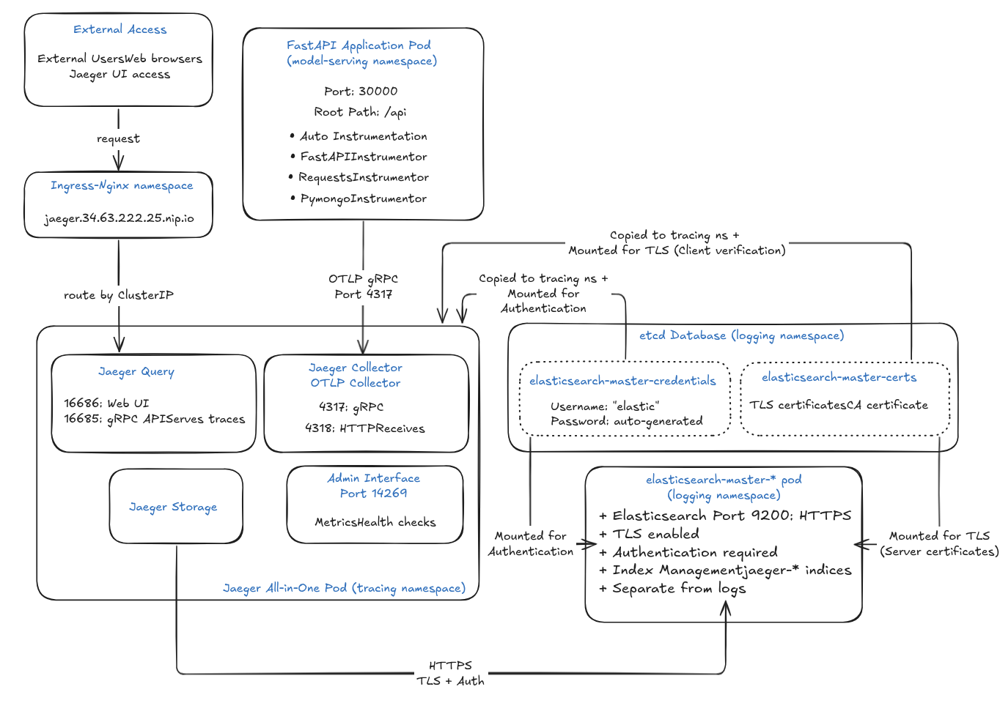

# 7. Distributed Tracing with Jaeger: Complete Implementation Guide

*Building production-ready distributed tracing for our FastAPI microservices*

---

## What We'll Learn

In this comprehensive guide, we'll discover how to implement distributed tracing in our FastAPI applications using Jaeger with Elasticsearch storage. Whether we're debugging performance issues or building observability into our microservices, this tutorial covers our complete implementation.

**By the end of this guide, we'll understand:**
- Why distributed tracing matters for our microservices
- How our Jaeger architecture works with Elasticsearch
- Our FastAPI application tracing implementation
- How to deploy and configure Jaeger in our Kubernetes cluster
- Best practices for production tracing

---

## Table of Contents

1. [Why We Need Distributed Tracing](#why-tracing)
2. [Our Jaeger Architecture](#architecture)
3. [Elasticsearch Storage Strategy](#storage)
4. [Our FastAPI Implementation](#implementation)
5. [Deployment Guide](#deployment)
6. [Monitoring and Analysis](#monitoring)
7. [Troubleshooting Guide](#troubleshooting)
8. [Production Best Practices](#best-practices)

---

## 1. Why We Need Distributed Tracing {#why-tracing}

Picture this: Our hand-gesture detection API is running slow. Users are complaining about response times, but we have no idea where the bottleneck is.

**Without distributed tracing, we're flying blind:**
```
"The API is slow, but we don't know if it's the ML model, 
database, or network causing the issue."
```

**With distributed tracing, we have X-ray vision:**
```
"The ML model inference takes 150ms, but the database 
query takes 2 seconds. We need to optimize the database."
```

### 1.1 The Microservices Observability Challenge

Our modern applications are distributed across multiple services. A single user request might touch:
- API Gateway
- Authentication Service
- Image Processing Service
- ML Model Service
- Database
- Cache Layer

When something goes wrong, traditional logging falls short. We need to see the **entire journey** of a request across all our services.

**Jaeger gives us this X-ray vision** - it's like a flight recorder for our microservices, showing us:
- **Where time is spent** - Which operations are slow?
- **Where errors occur** - Which component failed?
- **How services interact** - What calls what?
- **Performance trends** - Are things getting slower over time?

---

## 2. Our Jaeger Architecture {#architecture}

<div align="center">
  
  <p><em>Our Jaeger Architecture with Elasticsearch Storage</em></p>
</div>

Our Jaeger deployment consists of these key components working together:

### 2.1 Core Components

**Jaeger Collector**
- **Purpose**: Receives and processes traces from our applications
- **Port**: 4317 (OTLP gRPC) - where our FastAPI app sends traces
- **Configuration**: Direct connection (bypasses agent for simplicity)
- **Features**:
- Validates and processes trace data
- Batches traces for efficient storage
  - Stores traces in our Elasticsearch cluster

**Jaeger Query**
- **Purpose**: Provides the web UI and API for viewing traces
- **Port**: 16686 (Web UI)
- **Access**: `jaeger.<EXTERNAL_IP>.nip.io` (via Ingress)
- **Features**:
  - Beautiful web interface for exploring traces
  - REST API for programmatic access
  - Searches and retrieves traces from Elasticsearch

**Elasticsearch Storage**
- **Purpose**: Persistent storage for all trace data
- **Configuration**: Shared with our logging infrastructure
- **Benefits**:
  - Persistent data (survives restarts)
  - Rich search capabilities
  - Scalable storage
  - Cost-effective (shared with ELK stack)

### 2.2 Our Direct Connection Approach

Our application connects directly to the Jaeger Collector using OTLP gRPC:

```python
# From our tracer.py
otlp_exporter = OTLPSpanExporter(
    endpoint=f"{JAEGER_COLLECTOR_HOST}:4317",
    insecure=True,
)
```

**Why we chose direct connection:**
- **Simpler architecture** - One less component to manage
- **Lower latency** - Direct path to collector
- **Modern protocol** - Uses OTLP (industry standard)
- **Better error handling** - Direct connection errors are clearer
- **Resource efficient** - No agent overhead per node

### 2.3 Data Flow in Our Architecture

```
1. REQUEST PROCESSING
   FastAPI App → Generates spans → Batches locally

2. TRACE EXPORT
   OTLPSpanExporter → OTLP gRPC → Jaeger Collector (Port 4317)

3. STORAGE
   Jaeger Collector → Processes traces → Elasticsearch (jaeger-* indices)

4. VISUALIZATION
   Users → Jaeger UI → Queries Elasticsearch → Displays traces
```

---

## 3. Our Elasticsearch Storage Strategy {#storage}

We use Elasticsearch for persistent trace storage, sharing our existing ELK stack infrastructure.

### 3.1 Why Elasticsearch Works for Us

**Perfect for our production needs:**
- **Persistent storage** - Traces survive pod restarts
- **Rich search capabilities** - Complex queries on trace data
- **Scalable** - Handles our growing trace volume
- **Cost-effective** - Shared with our logging infrastructure
- **Mature technology** - Battle-tested in production

### 3.2 Our Storage Configuration

```yaml
# helm-charts/jaeger/values.yaml
provisionDataStore:
  elasticsearch: false  # Use existing cluster

storage:
  type: elasticsearch
  elasticsearch:
    host: elasticsearch-master.logging.svc.cluster.local
    port: 9200
    user: elastic
    existingSecret: elasticsearch-master-credentials
    existingSecretKey: password
    indexPrefix: jaeger  # Creates jaeger-* indices
```

### 3.3 Index Organization

Our Elasticsearch cluster contains both logging and tracing data, organized by index prefixes:

```
Logging Indices:
├── filebeat-2024.01.15
├── logstash-2024.01.15
└── ...

Tracing Indices:
├── jaeger-span-2024.01.15
├── jaeger-service-2024.01.15
└── jaeger-dependencies-2024.01.15
```

**Key benefits:**
- **No conflicts** - Different prefixes prevent data mixing
- **Shared resources** - Both systems benefit from cluster capacity
- **Unified search** - Can correlate logs and traces when needed
- **Operational efficiency** - One Elasticsearch cluster to manage

---

## 4. Our FastAPI Implementation {#implementation}

Our FastAPI application is instrumented with comprehensive tracing capabilities.

### 4.1 Core Tracing Setup

```python
# From our tracer.py
from opentelemetry import trace
from opentelemetry.exporter.otlp.proto.grpc.trace_exporter import OTLPSpanExporter
from opentelemetry.sdk.trace import TracerProvider
from opentelemetry.sdk.trace.export import BatchSpanProcessor

# Initialize tracer
tracer_provider = TracerProvider()
trace.set_tracer_provider(tracer_provider)

# Configure OTLP exporter
otlp_exporter = OTLPSpanExporter(
    endpoint=f"{JAEGER_COLLECTOR_HOST}:4317",
    insecure=True,
)

# Use batch processor for efficiency
span_processor = BatchSpanProcessor(
    otlp_exporter,
    max_queue_size=2048,
    schedule_delay_millis=5000,
    max_export_batch_size=512,
    export_timeout_millis=30000,
)

tracer_provider.add_span_processor(span_processor)
```

### 4.2 Automatic Instrumentation

Our application includes automatic instrumentation for:

```python
# HTTP requests
RequestsInstrumentor().instrument()

# FastAPI framework
FastAPIInstrumentor.instrument_app(app, tracer_provider=tracer_provider)

# MongoDB operations
PymongoInstrumentor().instrument()
```

### 4.3 Environment Configuration

```bash
# Core tracing settings
ENABLE_TRACING=true
OTEL_SERVICE_NAME=hand-gesture-api
JAEGER_COLLECTOR_HOST=jaeger-collector.tracing.svc.cluster.local

# Service identification
JAEGER_HOSTNAME=hand-gesture-api
```

### 4.4 Health Check Integration

```python
@app.get("/health")
async def health_check():
    if tracer:
        with tracer.start_as_current_span("health_check") as span:
            span.set_attribute("health.status", "ok")
            return {"status": "ok", "tracing": "enabled"}
    return {"status": "ok", "tracing": "disabled"}
```

---

## 5. Deployment Guide {#deployment}

### 5.1 Prerequisites

Our deployment requires:
- Kubernetes cluster with NGINX Ingress
- Existing Elasticsearch cluster (from our ELK stack)
- Helm 3.x installed
- kubectl and helm commands available

### 5.2 Automated Setup with Our Script

We've created a comprehensive setup script that handles the entire deployment process:

```bash
# Show available options
./scripts/setup-jaeger.sh help

# Install Jaeger stack (recommended)
./scripts/setup-jaeger.sh install

# Clean up existing installation
./scripts/setup-jaeger.sh cleanup

# Reinstall (cleanup + install)
./scripts/setup-jaeger.sh reinstall

# Verify installation
./scripts/setup-jaeger.sh verify

# Show connection information
./scripts/setup-jaeger.sh info
```

### 5.3 Manual Step-by-Step Deployment

If you prefer manual deployment, here are the individual steps our script performs:

**Step 1: Setup Prerequisites**
```bash
# Add Jaeger Helm repository
helm repo add jaegertracing https://jaegertracing.github.io/helm-charts
helm repo update

# Create tracing namespace
kubectl create namespace tracing
```

**Step 2: Copy Elasticsearch Credentials**
```bash
# Copy credentials from logging to tracing namespace
kubectl get secret elasticsearch-master-credentials -n logging -o yaml | \
  sed 's/namespace: logging/namespace: tracing/' | \
  sed '/resourceVersion:/d' | \
  sed '/uid:/d' | \
  sed '/creationTimestamp:/d' | \
  kubectl apply -f -

# Copy certificates for TLS connection
kubectl get secret elasticsearch-master-certs -n logging -o yaml | \
  sed 's/namespace: logging/namespace: tracing/' | \
  sed '/resourceVersion:/d' | \
  sed '/uid:/d' | \
  sed '/creationTimestamp:/d' | \
  kubectl apply -f -
```

**Step 3: Deploy Jaeger**
```bash
# Deploy Jaeger with our configuration
helm upgrade --install jaeger jaegertracing/jaeger \
  --namespace tracing \
  --values helm-charts/jaeger/values.yaml \
  --timeout 10m \
  --wait
```

**Step 4: Verify Deployment**
```bash
# Check all pods are running
kubectl get pods -n tracing

# Check services
kubectl get svc -n tracing

# Check ingress
kubectl get ingress -n tracing

# Verify Elasticsearch connectivity (DNS resolution)
kubectl exec -n tracing deployment/jaeger -- \
  nslookup elasticsearch-master.logging.svc.cluster.local

# Check Jaeger logs for Elasticsearch connection
kubectl logs -n tracing deployment/jaeger --tail=100 | grep -i elasticsearch
```

**Step 5: Test Application Tracing**
```bash
# Generate test traces (replace <EXTERNAL_IP> with your actual IP)
for i in {1..5}; do 
  curl -s http://asl.<EXTERNAL_IP>.nip.io/api/health > /dev/null && \
  echo "Request $i sent"
  sleep 1
done

# Check traces in Jaeger UI
curl -s "http://jaeger.<EXTERNAL_IP>.nip.io/api/services" | jq .
```

---

## 6. Monitoring and Analysis {#monitoring}

### 6.1 Accessing Our Jaeger UI

```bash
# Get connection information
./scripts/setup-jaeger.sh info

# Get Jaeger UI URL automatically
JAEGER_HOST=$(kubectl get ingress -n tracing -o jsonpath='{.items[0].spec.rules[0].host}')
echo "Jaeger UI: http://$JAEGER_HOST"

# Port forward for local access (if ingress not available)
kubectl port-forward -n tracing svc/jaeger-query 16686:16686
# Then access: http://localhost:16686
```

**Production URL**: `http://jaeger.<EXTERNAL_IP>.nip.io` (example: http://jaeger.34.63.222.25.nip.io)

### 6.2 Understanding the Jaeger UI

#### Search Interface

Our search page provides powerful filtering:

```
Search Options:
- Service: hand-gesture-api
- Operation: asl_prediction
- Tags: user.id=john123
- Duration: >100ms
- Time Range: Last 1 hour
```

#### Useful Queries for Our Application

**Find slow predictions:**
```
service=hand-gesture-api operation=asl_prediction duration>500ms
```

**Find failed requests:**
```
service=hand-gesture-api error=true
```

**Find specific user activity:**
```
service=hand-gesture-api prediction.user_id=user123
```

### 6.3 Elasticsearch Trace Analysis

We can also query our traces directly from Elasticsearch:

```bash
# List Jaeger indices
curl -X GET "localhost:9200/_cat/indices/jaeger*?v"

# Search for recent traces
curl -X GET "localhost:9200/jaeger-span-*/_search?pretty" \
  -H 'Content-Type: application/json' \
  -d '{"query": {"match": {"process.serviceName": "hand-gesture-api"}}}'
```

---

## 7. Troubleshooting Guide {#troubleshooting}

### 7.1 Common Issues and Solutions

#### 1. No traces appearing in Jaeger UI

**Debug steps:**
```bash
# Use our verification script first
./scripts/setup-jaeger.sh verify

# Check if our app is sending traces
kubectl logs -n model-serving deployment/hand-gesture-deployment | grep -i trace

# Check Jaeger logs (all-in-one deployment)
kubectl logs -n tracing deployment/jaeger

# Verify Jaeger is receiving spans
kubectl port-forward -n tracing deployment/jaeger 14269:14269 &
curl -s http://localhost:14269/metrics | grep jaeger

# Test Jaeger UI directly
JAEGER_HOST=$(kubectl get ingress -n tracing -o jsonpath='{.items[0].spec.rules[0].host}')
curl -s "http://$JAEGER_HOST/api/services"
```

#### 2. Elasticsearch connection issues

**Debug steps:**
```bash
# Test DNS resolution from Jaeger
kubectl exec -n tracing deployment/jaeger -- \
  nslookup elasticsearch-master.logging.svc.cluster.local

# Check Jaeger logs for Elasticsearch connection
kubectl logs -n tracing deployment/jaeger --tail=100 | grep -i elasticsearch

# Check if both secrets exist in tracing namespace
kubectl get secret elasticsearch-master-credentials -n tracing
kubectl get secret elasticsearch-master-certs -n tracing

# Verify Elasticsearch is healthy
kubectl get pods -n logging -l app=elasticsearch-master

# Test Elasticsearch directly
kubectl port-forward -n logging svc/elasticsearch-master 9200:9200 &
USERNAME=$(kubectl get secret elasticsearch-master-credentials -n logging -o jsonpath='{.data.username}' | base64 --decode)
PASSWORD=$(kubectl get secret elasticsearch-master-credentials -n logging -o jsonpath='{.data.password}' | base64 --decode)
curl -u "$USERNAME:$PASSWORD" -X GET "localhost:9200/_cluster/health"
```

#### 3. High application latency

**Solutions:**
```python
# Optimize batch processing
span_processor = BatchSpanProcessor(
    otlp_exporter,
    schedule_delay_millis=5000,  # Export every 5 seconds
    max_export_batch_size=512,   # Larger batches
    max_queue_size=2048          # Bigger buffer
)
```

### 7.2 Essential Debugging Commands

Our setup script provides automated verification, but here are the individual debugging commands:

```bash
# Use our verification script (recommended)
./scripts/setup-jaeger.sh verify

# Manual debugging commands:

# Check Jaeger deployment status
kubectl get pods -n tracing
kubectl get svc -n tracing
kubectl get ingress -n tracing

# Check Jaeger metrics endpoint
kubectl port-forward -n tracing deployment/jaeger 14269:14269 &
curl -s http://localhost:14269/metrics | grep -E "jaeger"

# Test Jaeger UI accessibility
JAEGER_HOST=$(kubectl get ingress -n tracing -o jsonpath='{.items[0].spec.rules[0].host}')
curl -s "http://$JAEGER_HOST/api/services"

# Verify Elasticsearch connectivity from Jaeger
kubectl exec -n tracing deployment/jaeger -- \
  nslookup elasticsearch-master.logging.svc.cluster.local

# Check Jaeger logs for Elasticsearch connection
kubectl logs -n tracing deployment/jaeger --tail=100 | grep -i elasticsearch

# Check Elasticsearch cluster health
kubectl port-forward -n logging svc/elasticsearch-master 9200:9200 &
USERNAME=$(kubectl get secret elasticsearch-master-credentials -n logging -o jsonpath='{.data.username}' | base64 --decode)
PASSWORD=$(kubectl get secret elasticsearch-master-credentials -n logging -o jsonpath='{.data.password}' | base64 --decode)
curl -u "$USERNAME:$PASSWORD" -X GET "localhost:9200/_cluster/health?pretty"

# List all Jaeger indices
curl -u "$USERNAME:$PASSWORD" -X GET "localhost:9200/_cat/indices/jaeger*?v"

# Check application tracing status
kubectl exec -n model-serving deployment/hand-gesture-deployment -- \
  env | grep -E "(ENABLE_TRACING|JAEGER_COLLECTOR_HOST)"

# Check if secrets exist in tracing namespace
kubectl get secret elasticsearch-master-credentials -n tracing
kubectl get secret elasticsearch-master-certs -n tracing
```

---

## 8. Production Best Practices {#best-practices}

### 8.1 Sampling Strategy

Don't trace everything - it's expensive:

```python
# Production sampling (trace 10% of requests)
from opentelemetry.sdk.trace.sampling import TraceIdRatioBased

tracer_provider = TracerProvider(
    sampler=TraceIdRatioBased(0.1)  # 10% sampling
)
```

### 8.2 Span Naming Conventions

Use descriptive, consistent names:

```python
# Good span names
"user_authentication"
"image_preprocessing"
"model_inference"
"database_query"

# Bad span names
"process"
"handle"
"function1"
```

### 8.3 Error Handling

Capture errors properly:

```python
try:
    result = risky_operation()
    span.set_attribute("operation.success", True)
except Exception as e:
    span.record_exception(e)
    span.set_status(Status(StatusCode.ERROR, str(e)))
    span.set_attribute("operation.success", False)
    raise
```

### 8.4 Resource Management

Monitor our Elasticsearch usage:

```bash
# Check index sizes
curl -X GET "localhost:9200/_cat/indices/jaeger*?v&s=store.size:desc"

# Set up index lifecycle management
curl -X PUT "localhost:9200/_ilm/policy/jaeger-policy" \
  -H 'Content-Type: application/json' \
  -d '{"policy": {"phases": {"delete": {"min_age": "30d"}}}}'
```

### 8.5 Performance Optimization

**Batch processing configuration:**
```python
BatchSpanProcessor(
    otlp_exporter,
    max_queue_size=2048,           # Buffer size
    schedule_delay_millis=5000,    # Export every 5 seconds
    max_export_batch_size=512,     # Traces per batch
    export_timeout_millis=30000,   # 30 second timeout
)
```

**Elasticsearch optimization:**
- Use appropriate shard sizes
- Set up proper retention policies
- Monitor cluster performance
- Consider dedicated nodes for trace data

---

## Key Takeaways

Our distributed tracing implementation provides:

- **Complete visibility** into our microservices architecture
- **Production-ready** Elasticsearch storage integration
- **Cost-effective** shared infrastructure approach
- **Modern OTLP** protocol for future compatibility
- **Comprehensive monitoring** and troubleshooting capabilities

**Next steps:**
1. Deploy our Jaeger configuration
2. Verify traces are flowing to Elasticsearch
3. Explore the Jaeger UI to understand our application behavior
4. Set up alerting for trace anomalies
5. Implement custom spans for business-specific insights

---

*This guide provides our complete distributed tracing implementation. Start with the basic deployment, then gradually add more sophisticated tracing as our applications grow.* 
